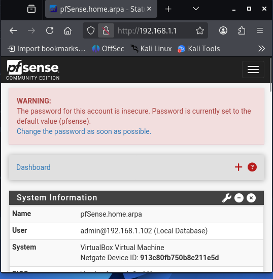
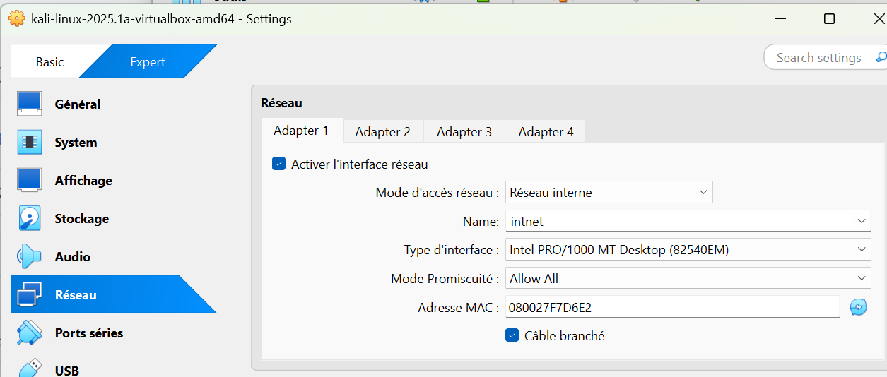
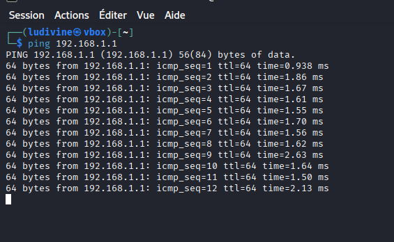
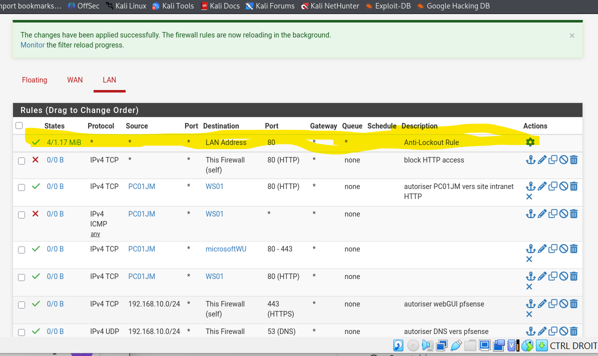
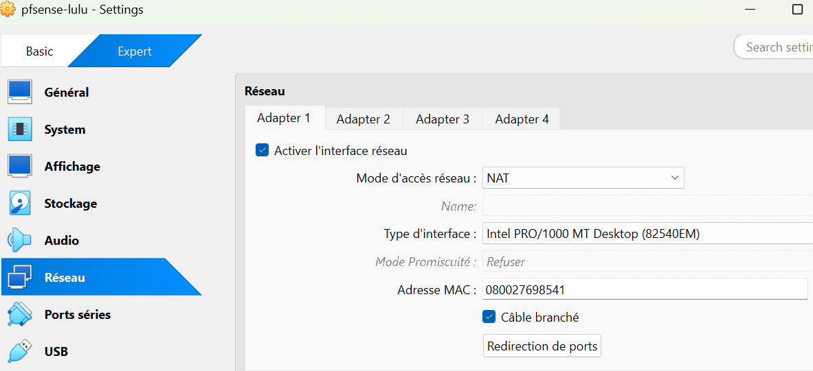

# pfsense-beginner-project
Mini projet cybersécurité : mise en place d’un firewall pfSense et simulation de tests réseau avec Kali Linux (scan nmap)/Cybersecurity project focused on configuring a pfSense firewall and testing its security through network scans using Kali Linux

The objective is to understand how a firewall works and how to analyze network traffic.

---

## 1- Network Setup

The environment was created using VirtualBox:

- pfSense → Firewall (WAN + LAN)
- Kali Linux → Client machine

Network flow:
Kali Linux (192.168.1.10) → pfSense (192.168.1.1)

---

## 2- Connectivity Test

The ping command was used to verify communication:

ping 192.168.1.1

Result: Successful communication between Kali and pfSense.

---

## 3- Network Scan

A scan was performed using Nmap:

nmap 192.168.1.1

Open ports detected:
- 80/tcp (HTTP)
- 53/tcp (DNS)

---

## 4- Firewall Rule

A rule was created to block HTTP access:

- Action: Block
- Protocol: TCP
- Destination: This Firewall
- Port: 80

---

## 5- Observation

The port 80 remained open.

Reason:
pfSense has a default anti-lockout rule that ensures access to the web interface from the LAN.

---

## 6- Troubleshooting

A DHCP issue occurred:

- Kali received an APIPA address (169.254.x.x)
- No IP was assigned by the DHCP server

Solution:
A static IP was assigned manually:

sudo ip addr add 192.168.1.10/24 dev eth0

---

## 7- Key Learnings

- Basic firewall configuration
- Network troubleshooting
- Use of ping for connectivity testing
- Use of nmap for network scanning
- Understanding firewall rule behavior
- ## Screenshots

### Accès interface pfSense

### Configuration réseau Kali

### Test de connectivité (Ping)

### Règles de pare-feu

### Blocage HTTP (Firewall)

### Scan Nmap
.png)

### Interface pfSense

---

## 8- Conclusion

This project demonstrates a basic cybersecurity workflow:

- Network setup
- Connectivity testing
- Network scanning
- Firewall configuration
- Security analysis
